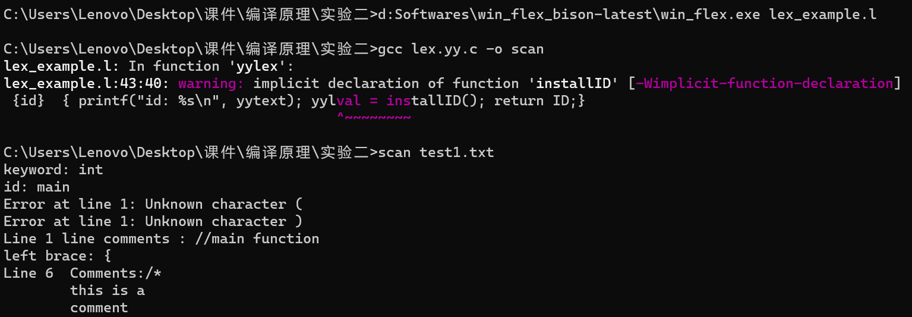

# 实验2 词法分析器的构造

| 姓名  | 学号             |
| --- | -------------- |

## 实验内容

利用 Flex 构造一个词法分析器，将输入的源程序转换为单词序列输出。

## 实验准备

下载安装win\_flex.exe，配置环境变量，打开cmd测试。



可以正常使用！

## 实验设计

-   设计token

    

    设计一个枚举类型 `yytokentype` ，来定义lex生成的所有记号的类型。

    解释如下：
    -   `INTNUM`：整数常量
    -   `FLNUM`：浮点数常量
    -   `FENUM`：科学计数法表示的浮点数常量
    -   `ID`：标识符
    -   `INT`：关键字 `int`
    -   `IF`：关键字 `if`
    -   `ELSE`：关键字 `else`
    -   `WHILE`：关键字 `while`
    -   `DO`：关键字 `do`
    -   `BREAK`：关键字 `break`
    -   `REAL`：关键字 `real`
    -   `TRUE`：关键字 `true`
    -   `FALSE`：关键字 `false`
    -   `RETURN`：关键字 `return`
    -   `CHAR`：关键字 `char`
    -   `BOOL`：关键字 `bool`
    -   `FLOAT`：关键字 `float`
    -   `RELOP`：关系运算符
        由yylex函数返回这个token
-   词法分析规则制定（正则表达式）

    
    -   `delim:` 空格、制表符、换行符。用于分隔词法元素。
    -   `ws`: 连续的空格、制表符、换行符。用于忽略不必要的空格。
    -   `letter`: 任何一个字母，大小写不限。
    -   `digit`: 任何一个数字（0\~9）。
    -   `id` :以字母开头，后面可以跟任意多个字母或数字的标识符。
    -   `number`: 整数，可以有一个可选的负号。
    -   `flnumber`: 浮点数，可以有一个可选的负号。
    -   `fenumber`: 科学计数法表示的浮点数，可以有一个可选的负号。
    -   `op`: 加、减、乘、除、赋值等操作符。
    -   `delimiter`: 大括号、小括号、逗号。用于分隔不同的语法元素。
-   解析
    ```docker
    {ws}    {;} //跳过连续空格、制表符、换行等

    \/\/([^\n])+  {  printf("Line %d line comments : %s\n", yylineno, yytext);}
    // 匹配 // 开头的单行注释

    \/\*([^\*])*\*([\*]|[^\*\/]([^\*])*[\*])*\/      { printf("Line %d\tComments:%s\n", yylineno, yytext); }
    // 匹配 /* comment */ 的多行注释
    ```
    keywords：int、char、float、bool、if、else、while、do、break、real、false、return：匹配对应的关键字，并在匹配到时输出关键字类型和对应的文本。

    {id}表示以字母开头，后面跟着字母或数字的识别符。当识别到这样的模式时，会调用installID()函数安装这个识别符，并将其传递给yylval。然后，该函数返回ID符号类型的标记，并输出相应的信息到标准输出。

    
-   其他函数
    1.  yywrap函数

        yywrap()函数在Flex中用于确定Flex是否应该继续扫描输入文件。当Flex扫描完输入文件时，它会自动调用yywrap()函数。如果yywrap()返回0，则Flex将继续扫描输入文件；如果yywrap()返回非0值，则Flex停止扫描并退出。在这段代码中，yywrap()函数返回1，表示Flex应该停止扫描输入文件。
    2.  installID函数

        installID()函数的作用是安装一个标识符。在编写语法分析器时，先使用installID()函数将识别出的标识符添加到符号表中。
    3.  main函数

        首先检查是否有参数，如果有参数则打开参数指定的文件，否则使用标准输入。然后它进入一个循环，每次循环调用 `yylex()` 函数来获取下一个词法单元的类型，将其存储在 `tok` 变量中。在循环体中，可以根据词法单元的类型进行不同的操作。循环直到遇到文件结尾或者 `yylex()` 函数返回 0。

## 运行结果

-   编译lex代码

    
-   样例1(基本语法)
    #### 输入
    ```docker
    {
      int i;
      if ( i >= 0) i = i + 1;
    }

    ```
    #### 输出
    
-   样例2（加上更多标识符）
    #### 输入：
    ```docker
    {
      int i; int j; float v; float x; float[100] a;
      while ( true) {
        do i = i + 1; while ( a[i] < v);
        do j = j - 1; while ( a[j] > v);
        if ( i >= j ) break;
        x = a[i]; a[i] = a[j]; a[j] = x;
      }
    }
    ```
    #### 输出：
    

    
-   样例3（加上更多形式浮点数）
    #### 输入：
    ```docker
    {
      float i = 12.3456, f[100];
      float j = 1e-13;
      if ( i < j ) {
        i = i - 1;
        j = j + 1;
      }
      else {
        i = i + 1;
      }
      return 0;
    }
    ```
    #### 输出：
    

## 所遇问题：

1.  lex语法不熟练

    解决：查询资料，了解示例代码中各个部分的含义。举一反三，完成实验代码的撰写。
2.  正则表达式

    解决：有一些正则表达式比较模糊，所以不断的尝试，并在纸上推导。

# 总结

总的来说，lex语法还是比较简单的，把我们省去了很多繁琐的工作，让我们能够更快捷更简单地使用书上学到地正则表达式去匹配词法。

## 代码：

```docker
%{
enum yytokentype{
  INTNUM = 300, FLNUM,FENUM,ID, 
  INT, IF, ELSE,WHILE,DO,BREAK,REAL,TRUE,FALSE,RETURN,
  CHAR,BOOL,FLOAT,RELOP
};


int yylval;    //全局变量


#define LT 1
#define LE 2
#define EQ 3
#define NE 4
#define GT 5
#define GE 6


%}


delim    [ \t\n]
ws    {delim}+
letter  [A-Za-z]
digit    [0-9]
id    {letter}({letter}|{digit})*
number  -?{digit}+        
flnumber   -?{digit}*\.{digit}+
fenumber  -?{digit}+(\.{digit}*)?([eE][+-]?{digit}+)?
op    [+\-*/=]
delimiter    [{}(),]
%option yylineno
%%


{ws}    {;}

\/\/([^\n])+  {  printf("Line %d line comments : %s\n", yylineno, yytext);}

\/\*([^\*])*\*([\*]|[^\*\/]([^\*])*[\*])*\/      { printf("Line %d\tComments:%s\n", yylineno, yytext); }
int    {  printf("INT\t\t%s\t\t\t%s\n", "keyword", yytext); return INT;}
char    {  printf("CHAR\t\t%s\t\t\t%s\n", "keyword", yytext); return CHAR;}
float    {  printf("FLOAT\t\t%s\t\t\t%s\n", "keyword", yytext); return FLOAT;}
bool    {  printf("BOOL\t\t%s\t\t\t%s\n", "keyword", yytext); return BOOL;}
if    {  printf("IF\t\t%s\t\t\t%s\n", "keyword", yytext); return IF;}
else    {  printf("ELSE\t\t%s\t\t\t%s\n", "keyword", yytext); return ELSE;}
while    {  printf("WHILE\t\t%s\t\t\t%s\n", "keyword", yytext); return WHILE;}
do    {  printf("DO\t\t%s\t\t\t%s\n", "keyword", yytext); return DO;}
break    {  printf("BREAK\t\t%s\t\t\t%s\n", "keyword", yytext); return BREAK;}
real    {  printf("REAL\t\t%s\t\t\t%s\n", "keyword", yytext); return REAL;}
false    {  printf("FALSE\t\t%s\t\t\t%s\n", "keyword", yytext); return FALSE;}
return  {  printf("RETURN\t\t%s\t\t\t%s\n", "keyword", yytext); return RETURN;}

{id}    {  printf("ID\t\t%s\t\t%s\n", "identifier", yytext); yylval = installID(); return ID;}
{number}  {  printf("CONST\t\t%s\t\t%s\n", "constant", yytext); return INTNUM;}
{flnumber}  {  printf("CONST\t\t%s\t\t%s\n", "constant", yytext); return FLNUM;}
{fenumber}  {  printf("CONST\t\t%s\t\t%s\n", "constant", yytext); return FENUM;}

{op}  {  printf("OP\t\t%s\t\t%s\n", "operator", yytext); }
   
"<"    {  printf("RELOP\t\t%s\t%s\n", "relation operator", yytext); yylval = LT; return RELOP;}
"<="    {  printf("RELOP\t%s\t\t%s\n", "relation operator", yytext); yylval = LE; return RELOP;}
"=="    {  printf("RELOP\t%s\t\t%s\n", "relation operator", yytext); yylval = EQ; return RELOP;}
"!="    {  printf("RELOP\t%s\t\t%s\n", "relation operator", yytext); yylval = NE; return RELOP;}
">"    {  printf("RELOP\t%s\t\t%s\n", "relation operator", yytext); yylval = GT; return RELOP;}
">="    {  printf("RELOP\t%s\t\t%s\n", "relation operator", yytext); yylval = GE; return RELOP;}

  
{delimiter}  {  printf("DELIM\t\t%s\t\t%s\n", "delimiter", yytext); return yytext[0];}
"["    {  printf("DELIM\t\t%s\t\t%s\n", "delimiter", yytext); return yytext[0];}
"]"    {  printf("DELIM\t\t%s\t\t%s\n", "delimiter", yytext); return yytext[0];}

";"    {  printf("DELIM\t\t%s\t\t%s\n", "delimiter", yytext); return yytext[0]; }

.           {  printf("Error at line %d: Unknown character %s\n", yylineno, yytext); return yytext[0]; }

%%


int main(int argc, char **argv ) 
{
  int tok;
  
  ++argv, --argc; /* skip over program name */
  if ( argc > 0 ) yyin = fopen( argv[0], "r" ); 
  else yyin = stdin; 

  
  while(tok = yylex()){
    ;
    //printf("\t<%d, %d>\n", tok, yylval); 
  }

} 

int yywrap()
{
  return 1;
}

/*function to be complete*/
int installID()
{
  return 0;
}

```
