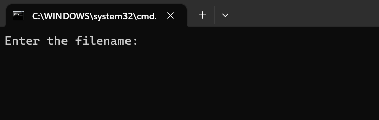

# 实验三

| 姓名  | 学号             |
| --- | -------------- |
| 陈锦涛 | 22920202204542 |

## 实验内容

用递归下降法编写一个语法分析程序，使之与词法分析器结合，能够根据语言的上下文无关文法，识别输入的单词序列是否文法的句子。（注意，需要改写文法，消除左递归等）

## 实验要求

1.  改写文法，是能够被正确解析（消除左递归、提取左公因子、消除二义性）
2.  计算每个非终结符的Fisrt集和Follow集，构造预测分析表
3.  给定一个源代码，输出对应的最左推导过程。
4.  支持文件读入

## 实验设计

### 一、改写文法

-   消除左递归

    

    消除之后的语法为：

    

    
-   提取左公因子

    

    提取左公因子之后为：【这里添加了两种RELOP：==和≠】

    
-   消除二义性

    

    消除二义性之后，else应该满足最近匹配原则。

    

### 二、修改实验二的lex代码

#### 1. token【终结符】


以上为所有的终结符

#### 2. 正则


基本不变

#### 3. 返回词法单元


### 三、构造预测分析表

#### 1. 最终文法：

```docker
1 program -> block
2 block -> '{' decls stmts '}'
3 decls -> decl decls
4        | epsilon
5 decl -> type ID ';'

5 stmts -> stmt stmts
6       | epsilon

7 stmt -> ID '=' expr ';'
8      | IF (bool) stmt ElseStmt
9         | WHILE (bool) stmt
10        | DO stmt WHILE (bool) ';'
11        | break ';'
12        | block

13 ElseStmt -> ELSE stmt
14          | epsilon

15  bool -> expr boolR

16  boolR -> < expr
17        | > expr
18        | <= expr
19        | >= expr
20        | == expr
21        | != expr
22        | epsilon

23  expr -> term exprR

24  exprR -> + term exprR
25        | - term exprR
26        | epsilon

27  term -> factor termR

28  termR -> * factor termR
29        | / factor termR
30        | epsilon

31  factor -> (expr)| ID | NUM
32  type -> INT | FLOAT | CHAR
```

#### 2. First集合

```docker
program -> {
block -> {
decls -> int float char epsilon
decl -> int float char
stmts -> ID IF WHILE DO break { epsilon
stmt -> ID IF WHILE DO break { epsilon
ElseStmt -> else epsilon
bool -> ID NUM (
boolR -> < > <= >= == != epsilon
expr -> ID NUM (
exprR -> + - epsilon
term -> ID NUM (
termR -> * / epsilon
factor -> ID NUM (
type -> int float char

```

#### 3. Follow集合

```docker
program -> $
block -> $ }
decls -> ID IF WHILE DO break { }
decl -> ID IF WHILE DO break { }
stmts -> ID IF WHILE DO break { }
stmt -> ID IF WHILE DO break { }
ElseStmt -> ID IF WHILE DO break { }
bool -> ; 
boolR -> ; $
expr -> ; ) $
exprR -> ; ) $
term -> ; ) $
factor -> ) ; 
type -> ID
```

#### 4. 预测分析表

由于预测分析表太大，暂不画出，可有FIRST集合和FOLLOW集合推出

#### 四、代码设计

1.  match函数
    ```c++
    void match(TOKEN t)
    {
      if (lookahead == t)  
        lookahead = yylex();
      else
        printf("token %d %c is needed\n", t, t);
    } 
    ```
    作用：匹配当前token并开始寻找下一个token
2.  非终结符函数

    

    对照预测分析表依次实现每个数

    以stmt函数为例：【其余函数见代码即可】
    ```c++
    void stmt()
    {
      if (lookahead == ID){
        printf("stmt -> ID '=' expr ';'\n");
        match(ID); match('='); expr(); match(';');
      }
      else if (lookahead == IF){
        printf("stmt -> IF (bool) stmt Elsestmt\n");
        match(IF); match('('); Bool(); match(')'); stmt(); ElseStmt();
      }
        else if(lookahead == WHILE){
            printf("stmt -> WHILE (bool) stmt\n");
            match(WHILE); match('('); Bool(); match(')'); stmt();
        }
        else if(lookahead == DO){
            printf("stmt -> DO stmt WHILE (bool) ';'\n");
            match(DO); stmt(); match(WHILE); match('('); Bool(); match(')'); match(';');
        }
        else if(lookahead == BREAK){
            printf("stmt -> break ';'\n");
            match(BREAK); match(';');
        }
        else if(lookahead == '{'){
            printf("stmt -> block\n");
            block();
        }
      else
        error(6);
    }
    ```
3.  main函数
    ```c++
    void Parse()
    {
      lookahead = yylex();
      program();  //start symbol
    }

    int main()
    {
        // 支持从文件读取
        char filename[1000] = "";
        printf("Enter the filename: ");
        scanf("%s", &filename);
        printf("\n");
        freopen(filename, "r", stdin);
       Parse();
        return 0;
    }
    ```
4.  error\[报错信息]

    

## 运行结果

-   编译lex代码

    

    

    输入需要读取的文件名即可
-   样例1(示例代码)
    #### 输入:【input01.txt】
    ```docker
    {
        int i;
        i = 10;
        if(j) j = 10;
        if(i) if(j) k=1000;
    }

    ```
    #### 输出:
    

    

    解析成功。
-   样例2（多个block）
    #### 输入：【input02.txt】
    ```docker
    {
        {
            int i;
            i=10;
        }
        {
            int j;
            if(j<10)j=20;
        }
        {
            
        }
    }
    ```
    #### 输出：
    

    

    解析正确。一个大的block内部三个小的block。
-   样例3（if-else）
    #### 输入：【input03.txt】
    ```docker
    {
        int testid;
        if(i<j) 
            if (i > j + 1) i=10;
            else i=10
        else j=10;
    }
    ```
    #### 输出：
    

    

    正确解析！
-   样例4（其他循环如while）
    #### 输入：【input04.txt】
    ```docker
    {
        float testid;
        testid=10;
        do 
            i=i+1;
        while(test<i);
    }
    ```
    #### 输出：
    

    

    正确解析！

## 所遇问题：

1.  文法复杂

    解决：一步一步解析。首先进行文法改写，使之能够被代码解析。

# 总结

1.  改写文法：本次实验中进行到的文法改写有消除左递归、消除二义性【if-else】、提取左公因子。使我对文法的改写的熟练度增加颇多。
2.  lex代码：在实验二的基础上改写lex代码，使之可以解析出本次实验的所有终结符即token。
3.  解析代码cpp：根据预测分析表写出每个非终结符对应的函数。需要注意的是match函数。只有当推导式中函数终结符时才能使用match函数。本次实验再这里踩过许多坑。

## 代码：

```c++
/*
文法
终结符： ID、NUM、IF、'{'、'}'  ';' '=', '<', '>', '<=', 
        '>=', '==', '!=', '+', '-', '*', '/', '(', ')', 
        'int', 'float', 'char', 'else', 'while', 'do', 'break'

1 program -> block
2 block -> '{' decls stmts '}'
3 decls -> decl decls
4        | epsilon
5 decl -> type ID ';'

5 stmts -> stmt stmts
6       | epsilon

7 stmt -> ID '=' expr ';'
8      | IF (bool) stmt ElseStmt
9         | WHILE (bool) stmt
10        | DO stmt WHILE (bool) ';'
11        | break ';'
12        | block

13 ElseStmt -> ELSE stmt
14          | epsilon

15  bool -> expr boolR

16  boolR -> < expr
17        | > expr
18        | <= expr
19        | >= expr
20        | == expr
21        | != expr
22        | epsilon

23  expr -> term exprR

24  exprR -> + term exprR
25        | - term exprR
26        | epsilon

27  term -> factor termR

28  termR -> * factor termR
29        | / factor termR
30        | epsilon

31  factor -> (expr)| ID | NUM
32  type -> INT | FLOAT | CHAR

FIRST集
program -> {
block -> {
decls -> int float char epsilon
decl -> int float char
stmts -> ID IF WHILE DO break { epsilon
stmt -> ID IF WHILE DO break { 
ElseStmt -> else epsilon
bool -> ID NUM (
boolR -> < > <= >= == != epsilon
expr -> ID NUM (
exprR -> + - epsilon
term -> ID NUM (
termR -> * / epsilon
factor -> ID NUM (
type -> int float char

follow集
program -> $
block -> $ }
decls -> ID IF WHILE DO break { }
decl -> ID IF WHILE DO break { }
stmts -> ID IF WHILE DO break { }
stmt -> ID IF WHILE DO break { }
ElseStmt -> ID IF WHILE DO break { }
bool -> = } 
boolR ->  } $
expr -> = } $ ;
exprR ->  } $ ;
term -> = ) + - < > <= >= == != ; IF WHILE DO break { } $
termR -> = } $ ;
factor -> = } ; $
type -> ID
*/ 


#include <iostream>
#include <fstream>
#include "lex.yy.c"    //由flex .l文件得到 
using namespace std;

TOKEN lookahead;

void program();
void block();
void decls();
void decl();
void stmts();
void stmt();
void ElseStmt();
void type();
void Bool();
void BoolR();
void expr();
void exprR();
void term();
void termR();
void factor();
void type();


void error(int no)
{
  printf("error: %d\n", no);  
} 

void match(TOKEN t)
{
  if (lookahead == t)  
    lookahead = yylex();
  else
    printf("token %d %c is needed\n", t, t);
} 

void program()
{
  printf("program -> block\n");
  block();
}

void block()
{
  printf("block -> '{' decls stmts '}'\n");
  if (lookahead == '{'){
    match('{'); decls(); stmts();match('}');
  }
  else
    error(2);
}

void decls()
{
    if (lookahead == INT || lookahead == FLOAT || lookahead == CHAR){
        printf("decls -> decl decls\n");
        decl(); decls();
    }
    else if (lookahead == ID || lookahead == IF 
        || lookahead == WHILE || lookahead == DO 
        || lookahead == BREAK || lookahead == '{'
        || lookahead == '}'){
        printf("decls -> epsilon\n");
        ;
    }
    else
        error(3);
}

void decl()
{
    if(lookahead == INT || lookahead == FLOAT) {
        printf("decl -> type ID ';'\n");
        type(); match(ID); match(';');
    }
    else
        error(4);
}

void stmts()
{
  //5 stmts -> stmt stmts 
  if (lookahead == ID || lookahead == IF 
        || lookahead == WHILE || lookahead == DO 
        || lookahead == BREAK || lookahead == '{'){
    printf("stmts -> stmt stmts \n");
    stmt(); stmts();
  }
  else if (lookahead == '}'){
    printf("stmts -> epsilon \n");
  }
  else
    error(5);
  
}


void stmt()
{
  if (lookahead == ID){
    printf("stmt -> ID '=' expr ';'\n");
    match(ID); match('='); expr(); match(';');
  }
  else if (lookahead == IF){
    printf("stmt -> IF (bool) stmt Elsestmt\n");
    match(IF); match('('); Bool(); match(')'); stmt(); ElseStmt();
  }
    else if(lookahead == WHILE){
        printf("stmt -> WHILE (bool) stmt\n");
        match(WHILE); match('('); Bool(); match(')'); stmt();
    }
    else if(lookahead == DO){
        printf("stmt -> DO stmt WHILE (bool) ';'\n");
        match(DO); stmt(); match(WHILE); match('('); Bool(); match(')'); match(';');
    }
    else if(lookahead == BREAK){
        printf("stmt -> break ';'\n");
        match(BREAK); match(';');
    }
    else if(lookahead == '{'){
        printf("stmt -> block\n");
        block();
    }
  else
    error(6);
}

void ElseStmt()
{
    if (lookahead == ELSE){
        printf("ElseStmt -> ELSE stmt\n");
        match(ELSE); stmt();
    }
    else if (lookahead == ID || lookahead == IF 
        || lookahead == WHILE || lookahead == DO 
        || lookahead == BREAK || lookahead == '{'
        || lookahead == '}'){
        printf("ElseStmt -> epsilon\n");
        ;
    }
    else
        error(7);
}

void type()
{
  if (lookahead == INT){
    printf("type -> INT \n");
    match(INT);
  }
  else if (lookahead == FLOAT){
    printf("type -> FLOAT\n");
    match(FLOAT);
  }
    else if (lookahead == CHAR){
        printf("type -> CHAR\n");
        match(CHAR);
    }
  else
    error(8);
} 

void Bool()
{
    if (lookahead == ID || lookahead == NUM || lookahead == '('){
        printf("bool -> expr boolR\n");
        expr(); BoolR();
    }
    else
        error(9);


}

void BoolR()
{
    if (lookahead == '<' || lookahead == '>' 
        || lookahead == LE || lookahead == GE 
        || lookahead == EQ || lookahead == NE){
        printf("boolR -> < expr\n");
        match(lookahead); expr();
    }
    else if (lookahead == ')' || lookahead == ';' || lookahead == '{' || lookahead == '}'){
        printf("boolR -> epsilon\n");
    }
    else
        error(10);
}

void expr()
{
    // printf("lookahead = %d\n", lookahead);
    if (lookahead == ID || lookahead == NUM || lookahead == '('){
        printf("expr -> term exprR\n");
        term(); exprR();
    }
    else
        error(11);
}

void exprR()
{
    if (lookahead == '+'){
        printf("exprR -> + term exprR\n");
        match(lookahead);term(); exprR();
    }
    else if (lookahead == '-'){
        printf("exprR -> - term exprR\n");
        match(lookahead);term(); exprR();
    }
    
    else if (lookahead == ')' || lookahead == ';' || lookahead == '<' || lookahead == '>' 
            || lookahead == LE || lookahead == GE || lookahead == EQ || lookahead == NE){
        
        printf("exprR -> epsilon\n");
    }
    else
        error(12);
}

void term()
{
    if (lookahead == ID || lookahead == NUM || lookahead == '('){
        printf("term -> factor termR\n");
        factor(); termR();
    }
    else
        error(13);
}

void termR()
{
    if (lookahead == '*'){
        printf("termR -> * factor termR\n");
        match(lookahead);factor(); termR();
    }
    else if (lookahead == '/'){
        printf("termR -> / factor termR\n");
        match(lookahead);factor(); termR();
    }
    else if (lookahead == ')' || lookahead == ';' || lookahead == '<' || lookahead == '>' 
            || lookahead == LE || lookahead == GE || lookahead == EQ || lookahead == NE
            || lookahead == '+' || lookahead == '-'){
        printf("termR -> epsilon\n");
    }
    else
        error(14);
}

void factor()
{
    if (lookahead == ID){
        printf("factor -> ID\n");
        match(ID);
    }
    else if (lookahead == NUM){
        printf("factor -> NUM\n");
        match(NUM);
    }
    else if (lookahead == '('){
        printf("factor -> (expr)\n");
        match('('); expr(); match(')');
    }
    else
        error(15);
}

void Parse()
{
  lookahead = yylex();
  program();  //start symbol
}

int main()
{
    // 支持从文件读取
    char filename[1000] = "";
    printf("Enter the filename: ");
    scanf("%s", &filename);
    printf("\n");
    freopen(filename, "r", stdin);
   Parse();
    return 0;
}


```
